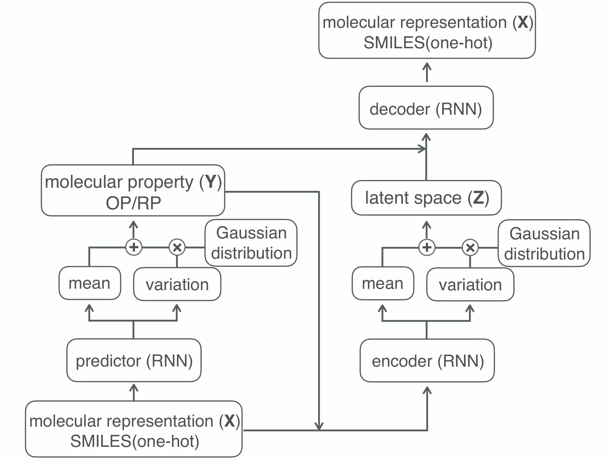

# SSVAE for electrolyte molecule design
The repository includes the semi-supervised VAE model and the execution script for automatical electrolyte molecular generation. 
The code is mainly forked by https://arxiv.org/abs/1805.00108. The method allows us to generate molecules with the desire property. 
The architecture of the SSVAE model is shown in figure below.

In this framework, the labeled data (from from Material Project https://materialsproject.org/) are used for building a property predictor which introduces the gaussian distribution in order to address the intractability of y. The missing y of unlabeled data 
(from ZINC https://zinc.docking.org/) are predicted by this property predictor. Next, the autoencoder are trained by the labeled data and the unlabeled data together. The RNN encoder maps x and y to the latent space z, similarly introducing the gaussian distribution, and then RNN decoder maps y and z to original x.

training SSVAE model    
```python run.py```

molecular generation   
```python IE_generation.py``` and ```python EA_generation.py```
